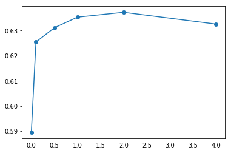

```python
%load_ext autoreload
%autoreload 2
%matplotlib inline
```


```python
import re
import csv
import glob
import numpy as np
import matplotlib.pyplot as plt
import tensorflow as tf
import jieba
# LingPlus is available from https://github.com/seantyh/LingPlus
from LingPlus import nb

from sklearn.feature_extraction.text import CountVectorizer
from sklearn.preprocessing import LabelBinarizer
from sklearn.model_selection import train_test_split
from sklearn.metrics import accuracy_score, recall_score, precision_score, f1_score
from sklearn.metrics import confusion_matrix
```

# Content
## [Preprocessing](#preproc)
* load subtitles
* segmentation and get rid of non-Chinese characters

## [Train-Test Split](#ttsplit)

## [Tuning](#tuning)
* use k-fold cross validation to tune the smoothing parameter

## [Evaluation](#eval)
* evaluate the model with the selected smoothing on test data


```python
def load_csv(fpath):
    fin = open(fpath, "r", encoding="UTF-8")
    csvreader = csv.reader(fin)
    next(csvreader)
    data = []
    for row in csvreader:
        data.append(row)
    return data
```


```python
data = []
for fpath in glob.glob("data/proc/*.csv"):    
    data += load_csv(fpath)
```


```python
nTW = len([x for x in data if x[1] == "TW"])
nCN = len([x for x in data if x[1] == "CN"])
print("TW items: ", nTW)
print("CN items: ", nCN)
```

    TW items:  6572
    CN items:  7049
    

<a id="preproc"></a>
# Preprocess data


```python
jieba.set_dictionary("data/as_jieba.txt")
san_pat = re.compile("[\u3400-\u9fff\uf900-\ufaffa-zA-Z0-9]")
import pdb
def do_tokenize(srt_item):    
    srt_tokens = srt_item
    if not isinstance(srt_item[2], str):        
        return srt_item
    tok_iter = map(lambda x: x.group(), san_pat.finditer(srt_item[2]))
    srt_tokens[2] = "".join(tok_iter)
    return srt_tokens

def do_segment(srt_item):    
    seg_item = srt_item
    seg_item[2] = list(jieba.cut(srt_item[2]))
    return seg_item

srt_data = map(do_tokenize, data)
srt_data = map(do_segment, srt_data)
srt_data = list(srt_data)
```

    Building prefix dict from E:\Dropbox\Dropbox\Kyle\LingNLP\Week5\data\as_jieba.txt ...
    Loading model from cache C:\Users\Sean\AppData\Local\Temp\jieba.u819fa9d31ffde37e51acb08492816972.cache
    Loading model cost 0.255 seconds.
    Prefix dict has been built succesfully.
    


```python
print(srt_data[0:10])
print(srt_data[1010:1020])
print(srt_data[5010:5020])
print(srt_data[8010:8020])
```

    [['1', 'TW', ['銀行']], ['2', 'TW', ['現在', '播放', '喇叭褲']], ['3', 'TW', ['手', '舉高']], ['4', 'TW', ['趴', '在', '地', '上']], ['5', 'TW', ['給我', '趴', '在', '地', '上', '趴下']], ['6', 'TW', ['趴下', '不準動']], ['7', 'TW', ['快']], ['8', 'TW', ['快點']], ['9', 'TW', ['通通', '不準動']], ['10', 'TW', ['趴下']]]
    [['1011', 'TW', ['他', '在', '98', '年', '逮過', '我']], ['1012', 'TW', ['你們', '打炮', '不', '戴套', '是', '你', '傢', '的', '事']], ['1013', 'TW', ['要是', '有', '人', '想', '幹掉', '我', '我會', '抓狂']], ['1014', 'TW', ['抓住', '他']], ['1015', 'TW', ['寶貝', '別', '讓', '他', '跑', '瞭']], ['1016', 'TW', ['快想', '辦法']], ['1017', 'TW', ['媽', '的']], ['1018', 'TW', ['載', '我們', '離開', '快', '閃']], ['1019', 'TW', ['我們', '走', '快點']], ['1020', 'TW', ['龍舌蘭']]]
    [['516', 'CN', ['我們', '能', '有', '今天', '這樣', '的', '成績', '最', '主要', '是', '因', '爲']], ['517', 'CN', ['對公', '衆', '而言', '我們', '是', '不', '存在', '的']], ['518', 'CN', ['如果', '這個', '視頻', '暗示', '甚至', '直接', '提到', '了', '我們']], ['519', 'CN', ['爲', '了', '所有', '客戶', '的', '利益', '考慮']], ['520', 'CN', ['我', '就', '不能', '讓', '它', '公之', '於', '衆']], ['521', 'CN', ['你', '以前', '叮囑', '我', '辦事', '要', '走', '正常', '程序']], ['522', 'CN', ['佐布里斯特', '先生', '像是', '什麼', '正常', '客戶', '嗎']], ['523', 'CN', ['這個麼', '這也', '是', '感嘆', '罷了', '把', '視頻', '拿給', '我']], ['524', 'CN', ['意大利', '佛羅倫薩', '馬基', '雅維利', '大道', '上午', '836']], ['525', 'CN', ['維奇', '奧宮', '五百', '人', '大廳', '裏', '有', '幅', '著名', '的', '壁畫']]]
    [['1963', 'CN', ['你', '當時', '害怕', '嗎']], ['1964', 'CN', ['我', '肯定', '在', '你', '的', '老朋友', '蜘蛛', '俠']], ['1965', 'CN', ['出現', '在', '那台', '電梯', '里', '時', '你', '很', '高興', '對', '嗎']], ['1966', 'CN', ['是', '的', '其實', '我並', '沒有', '上去']], ['1967', 'CN', ['我', '在', '樓下', '目睹', '了', '那', '一切']], ['1968', 'CN', ['沒錯']], ['1969', 'CN', ['他', '那天', '在', '那裡', '真是', '件', '幸事']], ['1970', 'CN', ['蜘蛛', '俠', '真是', '了不起']], ['1971', 'CN', ['爸爸', '綠燈', '亮', '了']], ['1972', 'CN', ['我們', '到', '了', '你們', '該', '下車', '了']]]
    


```python
vec = CountVectorizer(analyzer=lambda x: x, tokenizer=lambda x: x) 
lbin = LabelBinarizer()

tag_vec = np.array([x[1] for x in srt_data])
lbin.fit(tag_vec)
text_mat = vec.fit_transform([x[2] for x in srt_data])
print("Vocabulary generated by CountVectorizer: ", len(vec.vocabulary_))
```

    Vocabulary generated by CountVectorizer:  9313
    

<a id="ttsplit"></a>
# Train-Test data split


```python
train_x, test_x, train_y, test_y = train_test_split(text_mat, tag_vec, test_size=0.2, random_state=12)
print("Verify numbers of tag classes are comparable: ")
print("train TW: %.2f, CN: %.2f" % ((train_y=="TW").sum() / nTW, (train_y=="CN").sum() / nCN))
```

    Verify numbers of tag classes are comparable: 
    train TW: 0.80, CN: 0.80
    

<a id="tuning"></a>
# K-Fold(Stratified) model tuning


```python
sm_list = [0, 0.1,0.5,1,2,4]
sm_acc = []
for sm_alpha in sm_list:
    print("--- Smooth alpha: %f ---" % sm_alpha)    
    acc = nb.smooth_selection(sm_alpha, train_x, train_y)
    sm_acc.append(acc)

```

    --- Smooth alpha: 0.000000 ---
    Accuracy average: 0.5896
    --- Smooth alpha: 0.100000 ---
    Accuracy average: 0.6255
    --- Smooth alpha: 0.500000 ---
    Accuracy average: 0.6311
    --- Smooth alpha: 1.000000 ---
    Accuracy average: 0.6354
    --- Smooth alpha: 2.000000 ---
    Accuracy average: 0.6373
    --- Smooth alpha: 4.000000 ---
    Accuracy average: 0.6326
    


```python
plt.plot(sm_list, sm_acc, '-o')
```


    [<matplotlib.lines.Line2D at 0x1ea2819f400>]





<a id="eval"></a>
# Model Evaluation with Test Data


```python
# model training
enc_train_y = lbin.transform(train_y)
pY = enc_train_y.sum() / len(enc_train_y)
with tf.Graph().as_default() as g:
    model = nb.train(train_x, enc_train_y,
                    pY_prior=pY, smooth_alpha=2)

# model testing
with tf.Graph().as_default() as g:
    test_pred_vec = nb.predict(model, test_x)
    
test_pred_y = lbin.inverse_transform(np.array(test_pred_vec))
acc = accuracy_score(test_y, test_pred_y)
prec = precision_score(test_y, test_pred_y, pos_label="TW")
recall = recall_score(test_y, test_pred_y, pos_label="TW")
f1 = f1_score(test_y, test_pred_y, pos_label="TW")
    
print(lbin.classes_)
print("Accuracy: %.2f, Precision: %.2f, Recall: %.2f, F1: %.2f" 
      % (acc, prec, recall, f1))

```

    ['CN' 'TW']
    Accuracy: 0.64, Precision: 0.68, Recall: 0.52, F1: 0.59
    


```python
confusion_matrix(test_y, test_pred_y)
```


    array([[1046,  335],
           [ 643,  701]], dtype=int64)


# Discussion

* Final model has accuracy of 64%, F1-score is 0.59.
* Performance may be better if using tf-idf when generating word features.
* Segmentation was still an issue, since no special care was taken when segmenting China subtitles.
* Word encoder in preprocessing step used whole data to calculate vocabulary. It should honor the train-test data split next time, where vocabulary is only built from training data.
